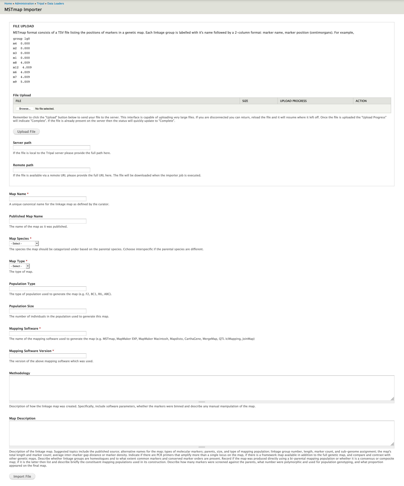
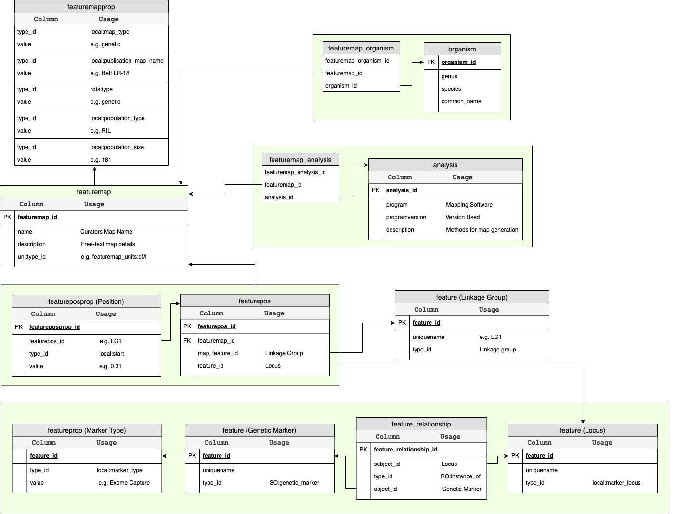

MSTmap Importer
================

This importer will load genetic maps which follow the same format output by the `MSTmap software <http://www.mstmap.org/>`_. This format consists of a TSV file listing the positions of markers in a genetic map. Each linkage group is labelled with it's name followed by a 2-column format: marker name, marker position (centimorgans). For example,

.. code::

  group lg0
  m4  0.000
  m2  0.000
  m3  0.000
  m1  0.000
  m8  4.009
  m12  4.009
  m6  4.009
  m7  4.009
  m9  5.009

The importer also stores metadata about the map through a well described form:

Validation
------------

.. warning::

  This is an outstanding todo item.

Data Storage
-------------

Metadata about the map including it's name, description, population type and size are stored in the featuremap and featuremapprop tables of chado; whereas, metadata describing the methodology is stored in the analysis table. Each position in the map is a combination of the linkage group, locus and genetic marker (features) with the position itself stored in the featurepos table. This is more clearly explained via the ER diagram below.

