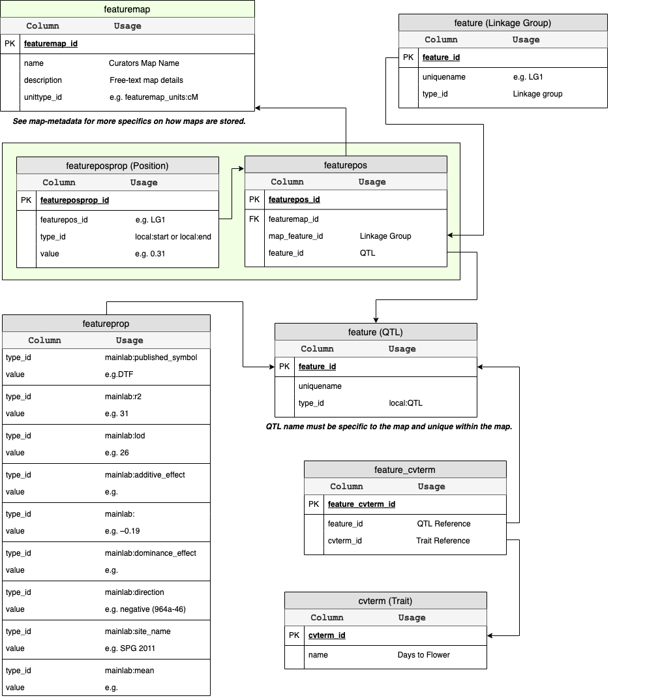

QTL Importer
==============

This importer will load quantitative trait loci (QTL) and associate them with a pre-existing map.

.. warning ::

  You must pre-load the map using the MST Map importer before you can load QTL associated with it.

Format
-------

We have developed our own format for this importer due to inconsistency in the community. The file must be tab-delimited, have linux line endings and a header. The description of the columns is as follows:

1. QTL Published Name: The name of the QTL as it was published.
2. Trait Full Name: The full name of the trait the QTL is contributing to (e.g. Days to Flower).
3. Trait Abbreviation: A short 2-5 letter abbreviation of the trait (e.g. DTF).
4. Environments (SiteYears): The environments a QTL is significant in (e.g. Preston 2009).
5. Peak Marker: The genetic marker closest to the peak LOD of the QTL.
6. Linkage Group: The linkage group the QTL is located on.
7. Peak Position: The cM position of the peak LOD for the QTL.
8. Peak LOD: The highest LOD score on the QTL graph.
9. Phenotypic r2: Phenotypic variance explained by the QTL (expressed as a fraction).
10. Additive Effect: The additive effect of each allele expressed as a fraction. The parent contributing the allele is supplied in the next column. This value is usually supplied as a negative or positive value dependant upon the contributing parent.
11. Contributor Parent: The parent which contributes to the effect of the QTL based on the value of the additive effect.
12. Confidence Interval Left (1 LOD drop):The LEFT cM position on the QTL graph where the LOD is ONE less then the peak LOD.
13. Confidence Interval Right (1 LOD drop): The RIGHT cM position on the QTL graph where the LOD is ONE less then the peak LOD.
14. Confidence Interval Left (2 LOD drop): The LEFT cM position on the QTL graph where the LOD is TWO less then the peak LOD.
15. Confidence Interval Right (2 LOD drop): The RIGHT cM position on the QTL graph where the LOD is TWO less then the peak LOD.

Validation
------------

- The genetic map must already exist in order for you to choose it in the form.
- The CV for the traits must already exist.
- The Trait name in your file must match a pre-existing term in the chosen trait controlled vocabulary.
- Empty lines are skipped.
- Linkage groups must already exist and names must match exactly what is in the file.
- The confidence interval values are optional.

Data Storage
-------------

QTL data is stored as expected by Tripal Map. Specifically, it is assumed the map matches the format described for the MST Map importer and QTL features are located on that map using the featurepos table. The position sotred in featurepos is the position of the QTL peak. This position is also stored in the featureposprop table along with the confidence interval values. See the following ER diagram for the full description of how the data is stored.

